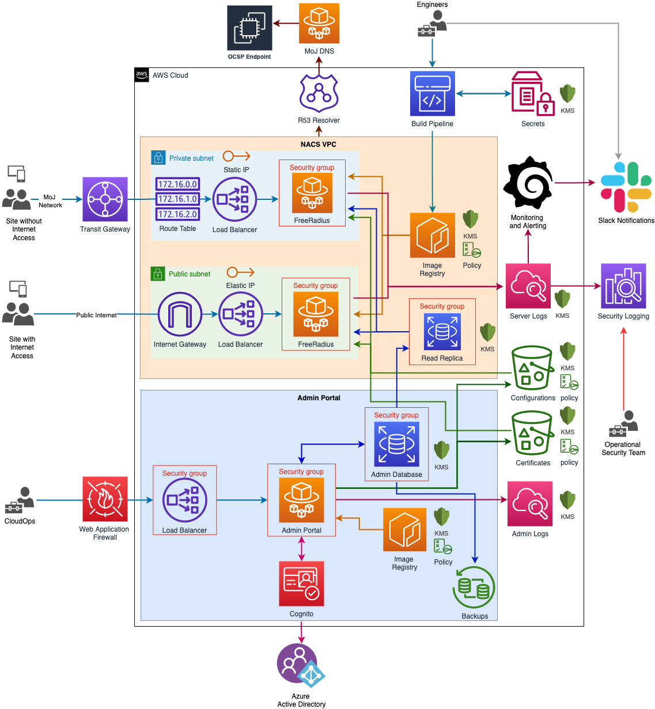

# MoJ Network Access Control AWS Infrastructure

## Introduction

This repository contains the Terraform code to build the AWS infrastructure for the Ministry of Justice's Network Access Control (NAC) platform. The infrastructure is implemented in AWS and applied using [AWS CodePipelines](https://aws.amazon.com/codepipeline/) specified in the Shared Services management account.

The running applications are defined and run as docker containers using [AWS Fargate](https://aws.amazon.com/fargate/)

## Related Repositories

This repository defines the **system infrastructure only**. Specific components and applications are defined in their own logical external repositories.

- [Shared Services](https://github.com/ministryofjustice/staff-device-shared-services-infrastructure)
- [Radius Server](https://github.com/ministryofjustice/network-access-control-server)
- [Disaster Recovery](https://github.com/ministryofjustice/network-access-control-disaster-recovery)
- [Integration Tests](https://github.com/ministryofjustice/network-access-control-integration-tests)
- [Admin Portal](https://github.com/ministryofjustice/network-access-control-admin)
- [Monitoring & Alerting](https://github.com/ministryofjustice/staff-infrastructure-monitoring-config)

## Other Documentation

- [Getting Started](documentation/getting-started.md)
- [Deploying NACS](documentation/deploying-nacs.md)
- [Debug Mode](documentation/debug-mode.md)
- [Disaster Recovery](documentation/disaster-recovery.md)
- [Failover](documentation/failover.md)
- [Authentication with Azure AD](documentation/azure-ad.md)
- [Vertically scaling the Read Replica](documentation/database-upgrade.md)
- [Setup Performance Testing](documentation/performance_testing.md)

## CI/CD

- [CI Terraform code - network-access-control-infrastructure](https://github.com/ministryofjustice/network-access-control-infrastructure)
- Terraform module - module "network-access-control-infrastructure"
- AWS Account - MOJ Official (Shared Services)
- [Pipeline "network-access-control-infrastructure"](https://eu-west-2.console.aws.amazon.com/codesuite/codepipeline/pipelines/network-access-control-infrastructure/view?region=eu-west-2)
